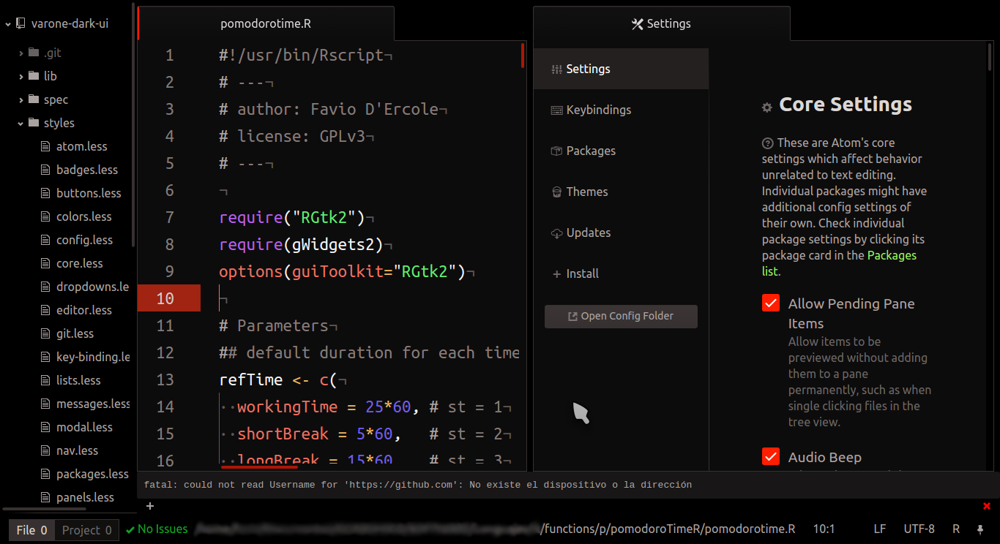

# Varone Dark Syntax theme

This is a dark syntax theme for Atom.

## Colors
### Gray palette
  

  

  

  

  

  

  

### Light palette
  

  

  

  

  

  

  

  

  

  

  

  

### Medium palette
  

  

  

  

  

  

  

  

  

  

  

  

### Dark palette
  

  

  

  

  

  

  

  

  

  

  

  

## Features
  - Very dark background.
  - Very light foreground.
  - Light colors for texts.

There is a matching UI theme [Varone Dark UI](https://github.com/fndercole/varone-dark-ui). For the screenshot I use both matching themes, with Ubuntu mono font.

